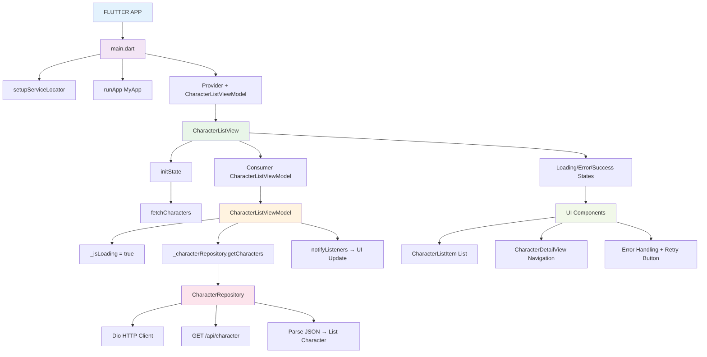
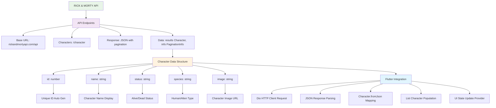

# 🎯 Projeto Pokemons - Backend NestJS + Frontend Flutter

> **Uma aplicação completa com backend em NestJS para gerenciamento de tarefas e frontend em Flutter para exibição de personagens da API Rick & Morty**

[](https://nestjs.com/)
[](https://flutter.dev/)
[](https://www.typescriptlang.org/)
[](LICENSE)

---

## 📋 Índice

- [📁 Estrutura do Projeto](#-estrutura-do-projeto)
- [🔄 Fluxograma do Sistema](#-fluxograma-do-sistema)
- [🚀 Backend - NestJS API](#-backend---nestjs-api)
- [📱 Frontend - Flutter App](#-frontend---flutter-app)
- [🔗 Integração entre Backend e Frontend](#-integração-entre-backend-e-frontend)
- [📝 Funcionalidades Implementadas](#-funcionalidades-implementadas)
- [🚀 Próximos Passos](#-próximos-passos)
- [👨‍💻 Autor](#-autor)
- [🤝 Contribuição](#-contribuição)
- [📞 Suporte](#-suporte)

---

## 📁 Estrutura do Projeto

```
Pokemons/
├── 📁 backend/                    # API NestJS para gerenciamento de tarefas
│   ├── 📁 src/
│   │   ├── 📁 todos/             # Módulo de tarefas
│   │   │   ├── 📄 dto/           # Data Transfer Objects
│   │   │   ├── 📄 entities/      # Entidades do domínio
│   │   │   ├── 📄 todos.controller.ts
│   │   │   ├── 📄 todos.service.ts
│   │   │   └── 📄 todos.module.ts
│   │   ├── 📄 app.module.ts      # Módulo principal
│   │   └── 📄 main.ts            # Ponto de entrada
│   ├── 📁 __test__/              # Testes unitários e de integração
│   ├── 📄 package.json           # Dependências e scripts
│   ├── 📄 jest.config.js         # Configuração de testes
│   └── 📄 tsconfig.json          # Configuração TypeScript
└── 📁 pokemons_app/              # Aplicação Flutter
    └── 📁 lib/
        ├── 📁 core/              # Constantes e configurações
        ├── 📁 data/              # Camada de dados
        │   ├── 📁 models/        # Modelos de dados
        │   └── 📁 repositories/  # Repositórios
        ├── 📁 presentation/      # Camada de apresentação
        │   ├── 📁 views/         # Telas da aplicação
        │   ├── 📁 viewmodels/    # ViewModels
        │   └── 📁 widgets/       # Widgets reutilizáveis
        ├── 📄 main.dart          # Ponto de entrada
        └── 📄 service_locator.dart # Injeção de dependência
```

---

## 🔄 Fluxograma do Sistema

### 📊 Fluxo Geral do Sistema

```mermaid
graph TB
    subgraph "Frontend (Flutter)"
        A[App Inicia] --> B[Setup DI]
        B --> C[Provider]
        C --> D[CharacterListView]
        D --> E[ViewModel]
        E --> F[Repository]
    end
    
    subgraph "Backend (NestJS)"
        G[Server Start] --> H[Load Modules]
        H --> I[Validation]
        I --> J[TodosController]
        J --> K[Service Layer]
        K --> L[In-Memory DB]
    end
    
    subgraph "API Externa (Rick & Morty)"
        M[API Online] --> N[Endpoints]
        N --> O[/character]
        O --> P[Response Data]
        P --> Q[Character Model]
    end
    
    F --> O
    D --> R[UI Components]
    E --> S[State Management]
    J --> T[CRUD Routes]
    K --> U[Business Logic]
    
    style A fill:#e1f5fe
    style G fill:#f3e5f5
    style M fill:#e8f5e8
    style R fill:#fff3e0
    style T fill:#fce4ec
    style U fill:#f1f8e9
```

### 🔄 Fluxo Detalhado - Frontend (Flutter)



### 🔄 Fluxo Detalhado - Backend (NestJS)

```mermaid
flowchart TD
    A[NESTJS API] --> B[main.ts]
    B --> C[NestFactory.create AppModule]
    B --> D[ValidationPipe whitelist, transform]
    B --> E[CORS enabled]
    B --> F[app.listen 3000]
    
    C --> G[AppModule]
    G --> H[imports: TodosModule]
    G --> I[Dependency Injection]
    G --> J[Module Registration]
    
    J --> K[TodosController]
    K --> L[POST /todos]
    K --> M[GET /todos]
    K --> N[GET /:id]
    K --> O[PATCH /:id]
    K --> P[DELETE /:id]
    
    L --> Q[Validation]
    M --> R[Return All]
    N --> S[Find One]
    O --> T[Update]
    P --> U[Delete]
    
    Q --> V[TodosService]
    R --> V
    S --> V
    T --> V
    U --> V
    
    V --> W[@Injectable]
    V --> X[Private todos: Todo[]]
    V --> Y[Private nextId = 1]
    V --> Z[CRUD Operations]
    V --> AA[Error Handling]
    
    Q --> BB[Data Validation]
    BB --> CC[CreateTodoDto]
    BB --> DD[UpdateTodoDto]
    BB --> EE[@IsString @IsNotEmpty]
    BB --> FF[@IsBoolean @IsOptional]
    
    style A fill:#f3e5f5
    style B fill:#e8f5e8
    style G fill:#fff3e0
    style K fill:#fce4ec
    style V fill:#f1f8e9
    style BB fill:#e1f5fe
```

### 🔄 Fluxo de Testes

```mermaid
flowchart TD
    A[TESTING STRATEGY] --> B[Unit Tests]
    A --> C[Integration Tests e2e]
    A --> D[Test Coverage]
    
    B --> E[DTO Tests]
    B --> F[Service Tests]
    B --> G[Controller Tests]
    B --> H[Module Tests]
    
    E --> I[Validation Rules]
    E --> J[Constraints]
    F --> K[Business Logic]
    F --> L[CRUD Operations]
    G --> M[HTTP Methods]
    G --> N[Mock Service]
    H --> O[DI Tests]
    H --> P[Registration]
    
    C --> Q[Test.createTestingModule]
    C --> R[createNestApplication]
    C --> S[ValidationPipe + CORS]
    C --> T[Supertest HTTP Requests]
    C --> U[Complete CRUD Flow]
    
    D --> V[DTOs: 100%]
    D --> W[Service: 100%]
    D --> X[Controller: 100%]
    D --> Y[Integration: 100%]
    
    V --> Z[Validation Edge Cases]
    W --> AA[Error Handling]
    X --> BB[HTTP Methods Mocking]
    Y --> CC[API Endpoints Flow Testing]
    
    style A fill:#e3f2fd
    style B fill:#f3e5f5
    style C fill:#e8f5e8
    style D fill:#fff3e0
```



### 🔄 Fluxo de Dados - API Externa



---

## 🚀 Backend - NestJS API

### 📋 Descrição
API RESTful desenvolvida em NestJS para gerenciamento de tarefas (todos) com validação de dados, tratamento de erros e testes abrangentes.

### 🛠️ Tecnologias Utilizadas

| Tecnologia | Versão | Descrição |
|------------|--------|-----------|
| **NestJS** | 10.0.0 | Framework Node.js para construção de aplicações escaláveis |
| **TypeScript** | 5.1.3 | Linguagem de programação tipada |
| **class-validator** | 0.14.0 | Validação de DTOs |
| **Jest** | 30.0.5 | Framework de testes |
| **Supertest** | 7.1.4 | Testes de integração |

### 🏗️ Arquitetura

#### Módulo Principal (`app.module.ts`)
```typescript
@Module({
  imports: [TodosModule],
})
export class AppModule {}
```

#### Configuração do Servidor (`main.ts`)
```typescript
async function bootstrap() {
  const app = await NestFactory.create(AppModule);
  
  // Configuração do ValidationPipe global
  app.useGlobalPipes(new ValidationPipe({
    whitelist: true,
    forbidNonWhitelisted: true,
    transform: true,
  }));

  // Configuração do CORS
  app.enableCors();

  await app.listen(3000);
  console.log('🚀 Servidor rodando na porta 3000');
}
```

### 📊 Entidades e DTOs

#### Entidade Todo (`todo.entity.ts`)
```typescript
export class Todo {
  id: number;
  title: string;
  isCompleted: boolean;
}
```

#### DTO de Criação (`create-todo.dto.ts`)
```typescript
export class CreateTodoDto {
  @IsString()
  @IsNotEmpty()
  title: string;

  @IsBoolean()
  @IsOptional()
  isCompleted?: boolean;
}
```

#### DTO de Atualização (`update-todo.dto.ts`)
```typescript
export class UpdateTodoDto {
  @IsString()
  @IsNotEmpty()
  @IsOptional()
  title?: string;

  @IsBoolean()
  @IsOptional()
  isCompleted?: boolean;
}
```

### 🔄 Rotas da API

#### Controller (`todos.controller.ts`)
```typescript
@Controller('todos')
export class TodosController {
  constructor(private readonly todosService: TodosService) {}

  @Post()                    // POST /todos
  create(@Body() createTodoDto: CreateTodoDto): Todo

  @Get()                     // GET /todos
  findAll(): Todo[]

  @Get(':id')                // GET /todos/:id
  findOne(@Param('id', ParseIntPipe) id: number): Todo

  @Patch(':id')              // PATCH /todos/:id
  update(@Param('id', ParseIntPipe) id: number, @Body() updateTodoDto: UpdateTodoDto): Todo

  @Delete(':id')             // DELETE /todos/:id
  remove(@Param('id', ParseIntPipe) id: number): Todo
}
```

### 🎯 Serviço de Negócio

#### Service (`todos.service.ts`)
```typescript
@Injectable()
export class TodosService {
  private todos: Todo[] = [];
  private nextId = 1;

  create(createTodoDto: CreateTodoDto): Todo {
    const todo: Todo = {
      id: this.nextId++,
      title: createTodoDto.title,
      isCompleted: createTodoDto.isCompleted || false,
    };
    
    this.todos.push(todo);
    return todo;
  }

  // ... outros métodos CRUD
}
```

### 🧪 Testes

#### Testes Unitários de DTOs (`dto.spec.ts`)
```typescript
describe('CreateTodoDto', () => {
  it('should pass validation with valid data', async () => {
    const dto = new CreateTodoDto();
    dto.title = 'Valid Todo';
    dto.isCompleted = false;

    const errors = await validate(dto);
    expect(errors).toHaveLength(0);
  });

  it('should fail validation when title is empty', async () => {
    const dto = new CreateTodoDto();
    dto.title = '';
    dto.isCompleted = false;

    const errors = await validate(dto);
    expect(errors).toHaveLength(1);
    expect(errors[0].constraints?.isNotEmpty).toBeDefined();
  });
});
```

#### Testes Unitários do Controller (`todos.controller.spec.ts`)
```typescript
describe('TodosController', () => {
  it('should create a new todo', () => {
    const createTodoDto: CreateTodoDto = {
      title: 'Test Todo',
      isCompleted: false,
    };

    const expectedResult = {
      id: 1,
      title: 'Test Todo',
      isCompleted: false,
    };

    jest.spyOn(service, 'create').mockReturnValue(expectedResult);
    const result = controller.create(createTodoDto);

    expect(service.create).toHaveBeenCalledWith(createTodoDto);
    expect(result).toEqual(expectedResult);
  });
});
```

#### Testes de Integração (`todos.integration.spec.ts`)
```typescript
describe('Todos (e2e)', () => {
  it('should create a new todo', () => {
    return request(app.getHttpServer())
      .post('/todos')
      .send({
        title: 'Test Todo',
        isCompleted: false,
      })
      .expect(201)
      .expect((res) => {
        expect(res.body).toHaveProperty('id');
        expect(res.body.title).toBe('Test Todo');
        expect(res.body.isCompleted).toBe(false);
      });
  });
});
```

### 🚀 Como Executar o Backend

#### 📦 Instalação
```bash
cd backend
npm install
```

#### ⚡ Scripts Disponíveis

| Comando | Descrição |
|---------|-----------|
| `npm run start:dev` | 🚀 Desenvolvimento com hot reload |
| `npm run start` | 🏭 Produção |
| `npm run test` | 🧪 Executar todos os testes |
| `npm run test:unit` | 🔬 Apenas testes unitários |
| `npm run test:integration` | 🔗 Apenas testes de integração |
| `npm run test:cov` | 📊 Testes com cobertura |
| `npm run build` | 📦 Compilar para produção |

---

## 📱 Frontend - Flutter App

### 📋 Descrição
Aplicação móvel desenvolvida em Flutter que consome a API externa Rick & Morty para exibir uma lista de personagens com detalhes.

### 🛠️ Tecnologias Utilizadas

| Tecnologia | Versão | Descrição |
|------------|--------|-----------|
| **Flutter** | 3.2.3 | Framework de desenvolvimento móvel |
| **Provider** | 6.1.1 | Gerenciamento de estado |
| **Dio** | 5.4.0 | Cliente HTTP |
| **GetIt** | 7.6.4 | Injeção de dependência |
| **json_annotation** | 4.8.1 | Serialização JSON |

### 🏗️ Arquitetura

#### Padrão MVVM (Model-View-ViewModel)
```
lib/
├── core/           # Configurações e constantes
├── data/           # Camada de dados (Repository, Models)
├── presentation/   # Camada de apresentação (Views, ViewModels)
└── service_locator.dart  # Injeção de dependência
```

### 🌐 Integração com API Externa

#### Constantes da API (`api_constants.dart`)
```dart
class ApiConstants {
  static const String baseUrl = 'https://rickandmortyapi.com/api';
  static const String charactersEndpoint = '/character';
}
```

#### Modelo de Dados (`character_model.dart`)
```dart
@JsonSerializable()
class Character {
  final int id;
  final String name;
  final String status;
  final String species;
  final String image;

  Character({
    required this.id,
    required this.name,
    required this.status,
    required this.species,
    required this.image,
  });

  factory Character.fromJson(Map<String, dynamic> json) => _$CharacterFromJson(json);
  Map<String, dynamic> toJson() => _$CharacterToJson(this);
}
```

#### Repository (`character_repository.dart`)
```dart
class CharacterRepository {
  final Dio _dio;

  CharacterRepository() : _dio = Dio();

  Future<List<Character>> getCharacters() async {
    try {
      final response = await _dio.get(
        '${ApiConstants.baseUrl}${ApiConstants.charactersEndpoint}',
      );

      if (response.statusCode == 200) {
        final List<dynamic> results = response.data['results'];
        return results.map((json) => Character.fromJson(json)).toList();
      } else {
        throw Exception('Falha ao carregar personagens');
      }
    } on DioException catch (e) {
      throw Exception('Erro de conexão: ${e.message}');
    } catch (e) {
      throw Exception('Erro inesperado: $e');
    }
  }
}
```

### 🎯 Gerenciamento de Estado

#### ViewModel (`character_list_viewmodel.dart`)
```dart
class CharacterListViewModel extends ChangeNotifier {
  final CharacterRepository _characterRepository = getIt<CharacterRepository>();
  
  bool _isLoading = false;
  List<Character> _characters = [];
  String? _errorMessage;

  bool get isLoading => _isLoading;
  List<Character> get characters => _characters;
  String? get errorMessage => _errorMessage;

  Future<void> fetchCharacters() async {
    _isLoading = true;
    _errorMessage = null;
    notifyListeners();

    try {
      _characters = await _characterRepository.getCharacters();
    } catch (e) {
      _errorMessage = e.toString();
    } finally {
      _isLoading = false;
      notifyListeners();
    }
  }
}
```

### 🎨 Interface do Usuário

#### Tela Principal (`character_list_view.dart`)
```dart
class CharacterListView extends StatefulWidget {
  @override
  Widget build(BuildContext context) {
    return Scaffold(
      appBar: AppBar(
        title: const Text('Rick & Morty Characters'),
        backgroundColor: Theme.of(context).colorScheme.inversePrimary,
      ),
      body: Consumer<CharacterListViewModel>(
        builder: (context, viewModel, child) {
          if (viewModel.isLoading) {
            return const Center(child: CircularProgressIndicator());
          }

          if (viewModel.errorMessage != null) {
            return Center(
              child: Column(
                children: [
                  const Icon(Icons.error_outline, size: 64, color: Colors.red),
                  Text('Erro ao carregar personagens'),
                  ElevatedButton(
                    onPressed: () => viewModel.fetchCharacters(),
                    child: const Text('Tentar Novamente'),
                  ),
                ],
              ),
            );
          }

          return ListView.builder(
            itemCount: viewModel.characters.length,
            itemBuilder: (context, index) {
              final character = viewModel.characters[index];
              return CharacterListItem(
                character: character,
                onTap: () => _navigateToDetail(character),
              );
            },
          );
        },
      ),
    );
  }
}
```

#### Item da Lista (`character_list_item.dart`)
```dart
class CharacterListItem extends StatelessWidget {
  final Character character;
  final VoidCallback onTap;

  @override
  Widget build(BuildContext context) {
    return Card(
      margin: const EdgeInsets.symmetric(horizontal: 16, vertical: 8),
      child: InkWell(
        onTap: onTap,
        child: Padding(
          padding: const EdgeInsets.all(16),
          child: Row(
            children: [
              ClipRRect(
                borderRadius: BorderRadius.circular(8),
                child: Image.network(
                  character.image,
                  width: 60,
                  height: 60,
                  fit: BoxFit.cover,
                  errorBuilder: (context, error, stackTrace) {
                    return Container(
                      width: 60,
                      height: 60,
                      color: Colors.grey[300],
                      child: const Icon(Icons.error),
                    );
                  },
                ),
              ),
              const SizedBox(width: 16),
              Expanded(
                child: Text(
                  character.name,
                  style: const TextStyle(fontSize: 16, fontWeight: FontWeight.w500),
                ),
              ),
              const Icon(Icons.arrow_forward_ios, size: 16),
            ],
          ),
        ),
      ),
    );
  }
}
```

#### Tela de Detalhes (`character_detail_view.dart`)
```dart
class CharacterDetailView extends StatelessWidget {
  final Character character;

  @override
  Widget build(BuildContext context) {
    return Scaffold(
      appBar: AppBar(
        title: Text(character.name),
        backgroundColor: Theme.of(context).colorScheme.inversePrimary,
      ),
      body: SingleChildScrollView(
        padding: const EdgeInsets.all(16),
        child: Column(
          crossAxisAlignment: CrossAxisAlignment.start,
          children: [
            Center(
              child: ClipRRect(
                borderRadius: BorderRadius.circular(12),
                child: Image.network(
                  character.image,
                  width: 200,
                  height: 200,
                  fit: BoxFit.cover,
                ),
              ),
            ),
            const SizedBox(height: 24),
            _buildDetailCard('Nome', character.name),
            _buildDetailCard('Status', character.status),
            _buildDetailCard('Espécie', character.species),
          ],
        ),
      ),
    );
  }
}
```

### 🔧 Injeção de Dependência

#### Service Locator (`service_locator.dart`)
```dart
final GetIt getIt = GetIt.instance;

void setupServiceLocator() {
  getIt.registerLazySingleton<CharacterRepository>(() => CharacterRepository());
}
```

#### Aplicação Principal (`main.dart`)
```dart
void main() {
  setupServiceLocator();
  runApp(const MyApp());
}

class MyApp extends StatelessWidget {
  @override
  Widget build(BuildContext context) {
    return MaterialApp(
      title: 'Pokemons App',
      theme: ThemeData(
        colorScheme: ColorScheme.fromSeed(seedColor: Colors.deepPurple),
        useMaterial3: true,
      ),
      home: ChangeNotifierProvider(
        create: (context) => CharacterListViewModel(),
        child: const CharacterListView(),
      ),
    );
  }
}
```

### 🚀 Como Executar o Frontend

#### 📋 Pré-requisitos
- ✅ Flutter SDK instalado
- ✅ Android Studio ou VS Code com extensões Flutter
- ✅ Emulador Android/iOS ou dispositivo físico

#### 📦 Instalação
```bash
cd pokemons_app
flutter pub get
```

#### ⚡ Execução
```bash
flutter run
```

#### 🔧 Geração de Código (se necessário)
```bash
flutter packages pub run build_runner build
```

---

## 🔗 Integração entre Backend e Frontend

### 📊 Fluxo de Dados

1. **Backend NestJS**: 
   - Gerencia tarefas localmente (sem persistência)
   - Fornece API RESTful com validação
   - Implementa testes unitários e de integração

2. **Frontend Flutter**:
   - Consome API externa Rick & Morty
   - Exibe lista de personagens
   - Implementa navegação e tratamento de erros

### 🌐 APIs Utilizadas

- **Backend**: API própria para gerenciamento de tarefas
- **Frontend**: API externa Rick & Morty (https://rickandmortyapi.com/api)

### 🧪 Cobertura de Testes

#### Backend ✅
| Tipo de Teste | Status | Cobertura |
|---------------|--------|-----------|
| **DTOs** | ✅ Implementado | 100% |
| **Controller** | ✅ Implementado | 100% |
| **Service** | ✅ Implementado | 100% |
| **Integração (e2e)** | ✅ Implementado | 100% |
| **Módulo** | ✅ Implementado | 100% |

#### Frontend ⚠️
| Tipo de Teste | Status | Cobertura |
|---------------|--------|-----------|
| **Unit Tests** | ⚠️ Não implementado | 0% |
| **Widget Tests** | ⚠️ Não implementado | 0% |
| **Integration Tests** | ⚠️ Não implementado | 0% |

---

## 📝 Funcionalidades Implementadas

### Backend (NestJS) ✅

| Funcionalidade | Status | Descrição |
|----------------|--------|-----------|
| **CRUD completo** | ✅ | Create, Read, Update, Delete de tarefas |
| **Validação de dados** | ✅ | class-validator com DTOs |
| **Tratamento de erros** | ✅ | Exceções personalizadas |
| **Testes abrangentes** | ✅ | Unitários e integração |
| **Configuração CORS** | ✅ | Cross-Origin Resource Sharing |
| **Documentação de rotas** | ✅ | Endpoints documentados |

### Frontend (Flutter) ✅

| Funcionalidade | Status | Descrição |
|----------------|--------|-----------|
| **Lista de personagens** | ✅ | Consumo da API Rick & Morty |
| **Tela de detalhes** | ✅ | Informações completas do personagem |
| **Estados da aplicação** | ✅ | Loading, Error, Success |
| **Navegação** | ✅ | Entre telas com Navigator |
| **Tratamento de erros** | ✅ | Erros de rede e UI |
| **Interface responsiva** | ✅ | Design moderno e adaptável |

---

## 🚀 Próximos Passos

### Backend 🔧

| Funcionalidade | Prioridade | Descrição |
|----------------|------------|-----------|
| **Persistência de dados** | 🔴 Alta | Implementar banco de dados (PostgreSQL/MongoDB) |
| **Autenticação** | 🟡 Média | JWT + Passport.js |
| **Autorização** | 🟡 Média | Roles e permissões |
| **Paginação** | 🟢 Baixa | Paginação de resultados |
| **Logs estruturados** | 🟢 Baixa | Winston ou Pino |
| **Ambiente de produção** | 🔴 Alta | Docker + CI/CD |

### Frontend 🔧

| Funcionalidade | Prioridade | Descrição |
|----------------|------------|-----------|
| **Testes unitários** | 🔴 Alta | Jest + Flutter Test |
| **Testes de widget** | 🟡 Média | Widget testing |
| **Cache local** | 🟡 Média | Hive ou SharedPreferences |
| **Busca e filtros** | 🟢 Baixa | Funcionalidade de pesquisa |
| **Animações** | 🟢 Baixa | Lottie ou Rive |
| **Tema escuro/claro** | 🟡 Média | ThemeData personalizado |

> **Legenda:** 🔴 Alta | 🟡 Média | 🟢 Baixa

---

## 📄 Licença

Este projeto está sob a licença **ISC**.

---

## 👨‍💻 Autor

**Matheus** - Desenvolvedor Full Stack

---

## 🤝 Contribuição

Contribuições são sempre bem-vindas! Para contribuir:

1. 🍴 Faça um fork do projeto
2. 🌿 Crie uma branch para sua feature (`git checkout -b feature/AmazingFeature`)
3. 💾 Commit suas mudanças (`git commit -m 'Add some AmazingFeature'`)
4. 📤 Push para a branch (`git push origin feature/AmazingFeature`)
5. 🔄 Abra um Pull Request

---

## 📞 Suporte

Se você tiver alguma dúvida ou problema, sinta-se à vontade para:

- 📧 Abrir uma [issue](../../issues)
- 💬 Entrar em contato via email
- 📱 Enviar uma mensagem

---

<div align="center">

**⭐ Se este projeto te ajudou, considere dar uma estrela! ⭐**

</div>
